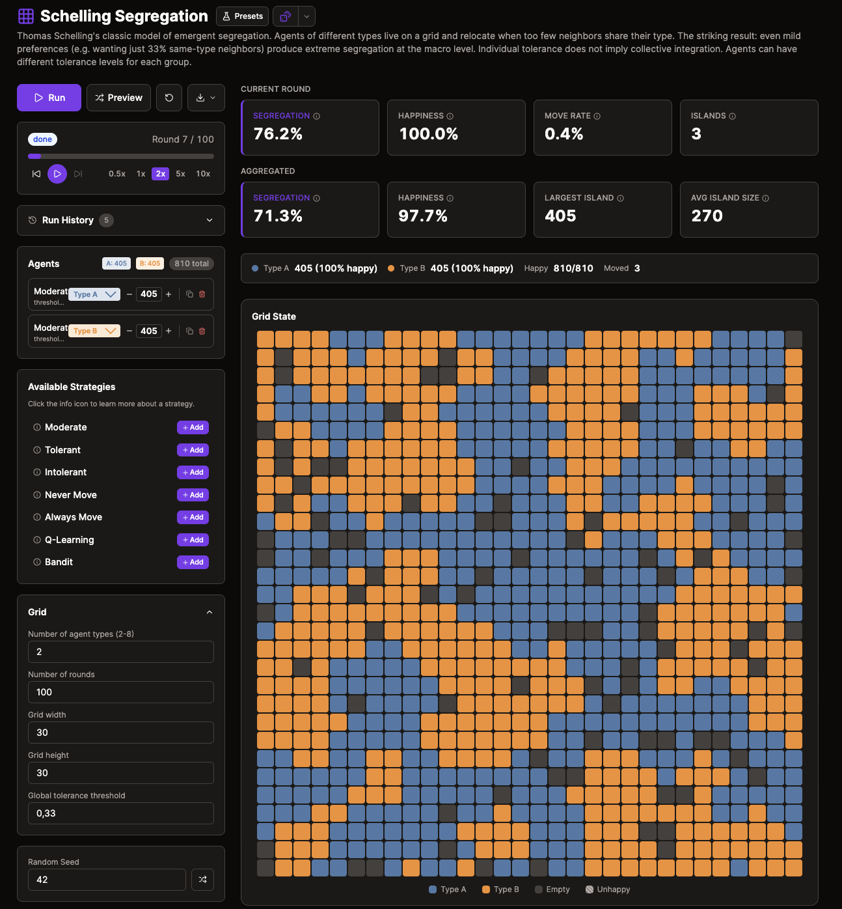
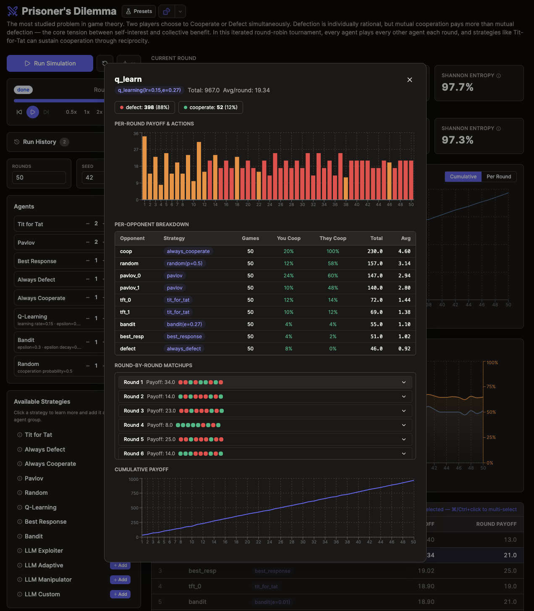

# PolicyArena

[](https://pypi.org/project/policy-arena/)
[](https://pypi.org/project/policy-arena/)
[](https://github.com/BaklazhenkoNikita/policyarena/actions/workflows/ci.yml)
[](LICENSE)

A simulation engine for game-theoretic agent research. PolicyArena lets you pit rule-based strategies, reinforcement learning, and LLM-powered agents against each other in classic game theory scenarios — all within the same run. Define experiments in YAML, run them from Python or the CLI, and compare how different decision-making paradigms perform under identical conditions: same game, same seed, same metrics.

The engine ships with a growing library of games — from Prisoner's Dilemma to SIR Epidemic — and a plug-in system that makes adding new ones straightforward. All built-in games are deployed to [policyarena.dev](https://www.policyarena.dev/), and new games added to the repo will appear there automatically.

Built for anyone running game-theory simulations — researchers, students, RL practitioners, and multi-agent systems developers. Works great without LLMs too; the core engine runs rule-based and RL experiments with zero external API dependencies.

<p align="center">
  
</p>
<p align="center">
  <em>Schelling Segregation on <a href="https://www.policyarena.dev/">policyarena.dev</a> — agents self-organize into clusters despite mild preferences</em>
</p>

<p align="center">
  
</p>
<p align="center">
  <em>Prisoner's Dilemma agent breakdown — per-opponent stats, round-by-round matchups, and cumulative payoff</em>
</p>

---

## Table of Contents

- [Features](#features)
- [Installation](#installation)
- [Quick Start](#quick-start)
  - [Built-in Examples](#run-a-built-in-example-no-config-needed)
  - [Python API](#python-api)
  - [Example Output](#example-output)
  - [CLI](#cli)
  - [YAML Config](#yaml-config)
- [How It Works](#how-it-works)
- [Games](#games)
- [Agent Types](#agent-types)
- [LLM Setup](#llm-setup)
- [Extending with New Games](#extending-with-new-games)
- [Error Handling](#error-handling)
- [Development](#development)
- [Contributing](#contributing)
- [Built With](#built-with)
- [License](#license)

---

## Features

- **Growing game library** — pairwise, N-player, and spatial/network games covering classic game theory (see [full list](#games))
- **Three agent paradigms** — rule-based strategies, tabular RL (Q-learning, bandit, best response), and LLM-powered agents (Claude, GPT, Gemini, Ollama)
- **Unified Brain interface** — all paradigms implement `decide()` / `update()` / `reset()`, making them directly comparable
- **YAML-driven experiments** — define games, agents, and parameters in config; built-in scenarios included for every game
- **Python API + CLI** — `pa.run()` for notebooks, `policy-arena run` for the terminal
- **Pluggable game system** — add games as self-contained packages with auto-discovery; third-party games register via entry points
- **Built on Mesa 3** — leverages Mesa's scheduling, topologies, and data collection
- **LLM integration via LangChain** — structured output with Pydantic, batch decisions, conversation history, configurable personas
- **Reproducible by default** — all runs are seeded; configs are snapshot-able
- **Lightweight core** — installs without LLM dependencies; `[llm]` extra adds provider SDKs only when needed

## Installation

```bash
pip install policy-arena
```

This installs the core package (rule-based + RL agents). For LLM-powered agents:

```bash
pip install policy-arena[llm]
```

Or install everything:

```bash
pip install policy-arena[all]
```

With [uv](https://docs.astral.sh/uv/):

```bash
uv add policy-arena            # core only
uv add policy-arena[llm]       # + LLM support
uv add policy-arena[all]       # everything
```

> Requires Python 3.12+

## Quick Start

### Run a Built-in Example (No Config Needed)

```bash
# List built-in scenarios
policy-arena examples

# Run one instantly
policy-arena run --example pd_rl_vs_rulebased --no-save
```

### Python API

```python
import policy_arena as pa

# Run a built-in scenario
results = pa.run(pa.get_scenario_path("pd_rl_vs_rulebased"))

# Access results as pandas DataFrames
print(results.model_metrics.tail())
print(results.agent_metrics.tail())

# Override parameters
results = pa.run(pa.get_scenario_path("pd_rl_vs_rulebased"), seed=123, rounds=500)

# List available games
pa.list_games()
# ['battle_of_sexes', 'chicken', 'commons', 'cournot', 'el_farol',
#  'auction', 'hawk_dove', 'info_cascade', 'minority_game',
#  'prisoners_dilemma', 'public_goods', 'schelling', 'sir',
#  'stag_hunt', 'trust_game', 'ultimatum', 'voting']

# Inspect a game's available strategies
registry = pa.get_registry()
reg = registry.get("prisoners_dilemma")
print(sorted(reg.brain_factories.keys()))
# ['always_cooperate', 'always_defect', 'bandit', 'best_response',
#  'llm', 'pavlov', 'q_learning', 'random', 'tit_for_tat']

# List built-in scenarios
pa.list_scenarios()
# ['battle_of_sexes_coordination', 'chicken_brinkmanship', ...]
```

### Example Output

Running the built-in Prisoner's Dilemma scenario produces two DataFrames — model-level and agent-level metrics per round:

**Model metrics** (aggregate per round):

```
     cooperation_rate  nash_eq_distance  social_welfare  strategy_entropy
195          0.333333          0.466667        0.600000          0.918296
196          0.366667          0.533333        0.633333          0.948078
197          0.333333          0.466667        0.600000          0.918296
198          0.366667          0.533333        0.633333          0.948078
199          0.333333          0.466667        0.600000          0.918296
```

**Agent metrics** (per agent per round):

```
               cumulative_payoff  round_payoff  cooperation_rate                  brain_name             label
Step  AgentID
200.0 1                   1816.0           9.0               0.4                 tit_for_tat               tft
      2                   2232.0           9.0               0.0               always_defect     always_defect
      3                   1230.0           6.0               1.0            always_cooperate  always_cooperate
      4                   1516.0           8.0               0.6                      pavlov            pavlov
      5                   2190.0           9.0               0.0  q_learning(lr=0.15,e=0.01)         q_learner
      6                   2224.0          13.0               0.0               best_response         best_resp
```

Both are standard pandas DataFrames — filter, plot, or export however you like.

### CLI

```bash
# List all games and their strategies
policy-arena games

# Show detailed info about a game
policy-arena info prisoners_dilemma

# Run from a YAML config
policy-arena run scenarios/pd_rl_vs_rulebased.yaml

# Run with overrides
policy-arena run scenarios/pd_rl_vs_rulebased.yaml --seed 42 --no-save

# Run a built-in example (no file needed)
policy-arena run --example pd_rl_vs_rulebased

# Validate a config without running
policy-arena validate scenarios/pd_rl_vs_rulebased.yaml

# Export results as JSON and YAML
policy-arena run scenarios/pd_rl_vs_rulebased.yaml --export-json --export-yaml

# Show version
policy-arena version
```

### YAML Config

```yaml
name: "PD — RL vs Rule-Based"
game: prisoners_dilemma
rounds: 200
seed: 42
agents:
  - name: tft
    strategy: tit_for_tat
    count: 3
  - name: always_defect
    strategy: always_defect
    count: 3
  - name: q_learner
    type: rl
    strategy: q_learning
    count: 2
    parameters:
      learning_rate: 0.15
      epsilon: 0.2
game_params:
  payoff_matrix:
    cc: [3, 3]
    cd: [0, 5]
    dc: [5, 0]
    dd: [1, 1]
```

Every game has a built-in scenario. See them with `policy-arena examples`.

## How It Works

Every agent is controlled by a **Brain** — the same interface regardless of paradigm:

```python
class Brain(ABC):
    def decide(self, observation) -> action   # Choose an action
    def update(self, result) -> None          # Learn from outcome
    def reset(self) -> None                   # Reset for new game
```

A Tit-for-Tat brain is 4 lines. A Q-learning brain maintains a Q-table. An LLM brain makes an API call to Claude/GPT/Gemini. The engine doesn't care — same interface, same metrics, same run loop.

```
YAML Config  →  Scenario  →  Mesa Model  →  RunResults
(or Python)     (dataclass)   (step loop)    (DataFrames)
```

Games are [Mesa 3](https://mesa.readthedocs.io/) models. Each step: agents decide simultaneously, the model resolves outcomes, brains learn. Mesa handles scheduling, topologies, and data collection.

See the [architecture docs](https://BaklazhenkoNikita.github.io/policyarena/architecture/) for the full design with code examples.

## Games

### Pairwise (Round-Robin)

| Game | Description |
|------|-------------|
| **Prisoner's Dilemma** | Classic cooperation vs defection dilemma |
| **Stag Hunt** | Risky cooperation (stag) vs safe defection (hare) |
| **Hawk-Dove** | Aggression vs sharing over a resource |
| **Chicken** | Anti-coordination — swerve or crash |
| **Battle of the Sexes** | Coordination with conflicting preferences |
| **Trust Game** | Sender sends money (multiplied), receiver returns a share |
| **Ultimatum** | Proposer offers a split, responder accepts or rejects |

### N-Player (Collective)

| Game | Description |
|------|-------------|
| **Public Goods** | Contribute to a shared pool, multiplied and split equally |
| **Cournot Oligopoly** | Firms choose production quantities; market price falls with total output |
| **El Farol Bar** | Attend only if crowd is below threshold |
| **Tragedy of the Commons** | Extract from a shared renewable resource |
| **Minority Game** | Choose between two options — minority wins |
| **Voting & Election** | N voters elect candidates under plurality, approval, or Borda rules |
| **Sealed-Bid Auction** | First-price or second-price (Vickrey) sealed-bid auction with private values |
| **Information Cascade** | Sequential binary decisions with private signals — herding dynamics |

### Spatial / Network

| Game | Description |
|------|-------------|
| **Schelling Segregation** | Agents on a grid relocate based on neighbor similarity |
| **SIR Epidemic** | Disease spread on network with strategic isolation |

All pairwise and collective games support rule-based, RL, and LLM agents. Spatial/network games support rule-based and RL.

Try these games interactively at [policyarena.dev](https://www.policyarena.dev/).

## Agent Types

**Rule-based** (`brains/rule_based/`) — Fixed strategies: Tit-for-Tat, Always Cooperate, Always Defect, Pavlov, Random, plus game-specific heuristics. Deterministic, fast, interpretable.

**Reinforcement Learning** (`brains/rl/`) — Tabular Q-learning with epsilon-greedy exploration, best response (tracks opponent frequencies), and multi-armed bandit. Configurable `learning_rate`, `epsilon`, `epsilon_decay`, `discount`, `seed`.

**LLM-powered** (`brains/llm/`) — Language model agents via LangChain. Uses Pydantic schemas with `with_structured_output()` for reliable action parsing. Supports configurable personas, conversation history, batch decisions (one LLM call per round), and fallback actions on failure.

## LLM Setup

> Requires `pip install policy-arena[llm]`

Set API keys as environment variables:

```bash
export ANTHROPIC_API_KEY=sk-ant-...
export OPENAI_API_KEY=sk-...
export GOOGLE_API_KEY=...
```

Or use a `.env` file. For local models, run [Ollama](https://ollama.ai/) and use `provider: ollama` in your config.

| Provider | Package | Example Model |
|----------|---------|---------------|
| Anthropic | `langchain-anthropic` | `claude-sonnet-4-6` |
| OpenAI | `langchain-openai` | `gpt-5.4` |
| Google | `langchain-google-genai` | `gemini-3.1-flash` |
| Ollama (local) | `langchain-ollama` | `llama4` |

Optional [Langfuse](https://langfuse.com/) tracing is supported for LLM observability.

## Extending with New Games

Games self-register via the [`GameRegistration`](src/policy_arena/registration.py) system. Create a new package under `policy_arena/games/`:

```python
# policy_arena/games/my_game/__init__.py
from policy_arena.registration import GameRegistration
from .model import MyGameModel
from .brains import StrategyA, StrategyB

REGISTRATION = GameRegistration(
    id="my_game",
    model_class=MyGameModel,
    brain_factories={
        "strategy_a": lambda **_: StrategyA(),
        "strategy_b": lambda **kw: StrategyB(param=kw.get("param", 1.0)),
    },
)
```

The game is auto-discovered on next import — no need to edit any central file. Third-party packages can also register via entry points:

```toml
# In your package's pyproject.toml
[project.entry-points."policy_arena.games"]
my_game = "my_package.games.my_game"
```

See the [architecture docs](https://BaklazhenkoNikita.github.io/policyarena/architecture/) for the full game package structure and extending guide.

## Error Handling

All domain errors inherit from `PolicyArenaError` and carry machine-readable `code`, `message`, and `details` fields:

```python
from policy_arena.errors import GameNotFoundError, StrategyNotFoundError

try:
    pa.run(config)
except GameNotFoundError as e:
    print(e.code)     # "GAME_NOT_FOUND"
    print(e.details)  # {"game_id": "...", "available": [...]}
except StrategyNotFoundError as e:
    print(e.code)     # "STRATEGY_NOT_FOUND"
```

| Error | Code | When |
|-------|------|------|
| `GameNotFoundError` | `GAME_NOT_FOUND` | Game ID not in registry |
| `StrategyNotFoundError` | `STRATEGY_NOT_FOUND` | Strategy not registered for a game |
| `ConfigValidationError` | `CONFIG_VALIDATION_ERROR` | Scenario config fails validation |
| `SimulationError` | `SIMULATION_ERROR` | Simulation fails during execution |
| `LLMProviderError` | `LLM_PROVIDER_ERROR` | LLM provider call fails irrecoverably |
| `LLMNotInstalledError` | `LLM_NOT_INSTALLED` | LLM deps missing |

## Development

```bash
git clone https://github.com/BaklazhenkoNikita/policyarena.git
cd policyarena
uv sync --all-extras          # install all optional deps
uv run pre-commit install     # set up ruff check + format hooks
uv run pytest tests/ -x       # run tests
uv run ruff check src/ tests/
uv run ruff format --check src/ tests/
uv run mypy src/policy_arena/
```

CI runs on Python 3.12 and 3.13 with lint, format check, type check, and tests (65% coverage threshold).

## Contributing

See [CONTRIBUTING.md](CONTRIBUTING.md) for setup, code style, and how to add new games.

Short version: fork, create a feature branch, open a PR targeting `main`.

## Built With

- [Mesa 3](https://mesa.readthedocs.io/) — Agent-based modeling (scheduling, topologies, data collection)
- [LangChain](https://python.langchain.com/) — Provider-agnostic LLM integration
- [Pydantic](https://docs.pydantic.dev/) — Config validation and LLM structured output
- [Polars](https://pola.rs/) — Parquet output for results
- [Typer](https://typer.tiangolo.com/) — CLI
- [Langfuse](https://langfuse.com/) — Optional LLM tracing

## License

[MIT](LICENSE) — Copyright 2026 Nikita Baklazhenko

---

See [CHANGELOG.md](CHANGELOG.md) for release history.
